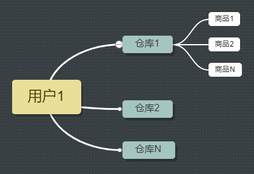

## scancode 微信小程序 Django 后台

- 文件结构
- 工作流程
- 某些技术细节 / 登陆验证过程 | API | models设计 | 避开 csrf 验证

#### 运行环境

- python3
- django1.10
- windows/linux/macos(未测试)

#### 依赖库

- django
- pycryptodomex
- requests

#### 数据库

- mysql

#### 文件结构

文件结构和一般的 django 项目一样，只是在 mycode 文件夹下增加了 checkuser.py 和 WXBizDataCrypt.py 两个文件，作用分别为验证用户信息文件以及微信官方给出的解码加密信息文件。


#### models.py

项目的存储包括 4 个表，用户信息 -- 仓库 -- 商品 -- 日志

其中 用户信息 -- 仓库 -- 商品 的关系为：



他们之间分别用 ForeignKey 外键连接起来。

```python

class Profile(models.Model):
    # ...

class Directory(models.Model):
    owner = models.ForeignKey('Profile', verbose_name='拥有者')
    # ...

class Goods(models.Model):
    belong = models.ForeignKey('Directory', verbose_name='商品归属库', default=None)
    # ...

```

#### 绕过 django 的 csrf 机制

django 与 小程序 通信时会遇到 csrf 验证问题，解决办法为在 views.py 中的函数加上 @csrf_exempt 装饰器。
代码示例如下：

```python

@csrf_exempt
def index(request):
    return Httpresponse('hello, mina')

```

#### JsonResponse

django 与 小程序之间采用 json 类型的数据通信，所以在 views.py 中采用 JsonResponse 响应小程序请求，返回 json 数据

```python

def index(request):
    data = {'content': 'hello,world'}
    return JsonResponse(data)

```

#### 登陆验证
使用 django 作为后端时在登陆方面需要注意

- 不支持 COOKIE
- 不支持 django 内置的 user 登录, 因为它使用的是微信的用户系统

这意味着你需要通过其他的手段进行登陆验证，下面给出官方推荐的解决方案

参考文档：
官方文档：https://mp.weixin.qq.com/debug/wxadoc/dev/api/api-login.html#wxloginobject
《微信小程序七日谈》- 第五天：你可能要在登录功能上花费大力气：http://www.cnblogs.com/ihardcoder/p/6279602.html

登陆流程图：


本程序的登陆流程代码

小程序端
app.js
```javascript

// 初始化发送到后台的数据
var encryptdata = {}

// 通过登陆获取加密信息
wx.login({
        // 登陆成功后得到 code
      success: function (res) {
        encryptdata['code'] = res['code']
        // 请求用户信息
        wx.getUserInfo({
          success: function (res) {
              // 请求用户信息后获取 iv encryptedData 值
            encryptdata['encrypteddata'] = res['encryptedData']
            encryptdata['iv'] = res['iv']
        }
    })
}
})

// 请求后端
wx.request({
      url: domain_url+'login/',
      method:'POST',
      // 处理 json 数据   
      data: Util.json2Form(encryptdata),
      header: {
        'content-type': 'application/x-www-form-urlencoded'
      },
      success: function (res) {
          // ..
      }
  })

```

django 端

后端拿到小程序发送的信息之后，分为两步处理，首先使用 appid 和 secret 以及 code 请求微信服务器，获取 session_key 和 openid

```python

# 从官网获取 appid 以及 secret
appid = 'yourappid'
secret = 'yoursecret'
# 从小程序响应内容获取 code
code = 'yourcode'

# 微信服务器链接
url ='https://api.weixin.qq.com/sns/jscode2session?appid={0}&secret={1}&js_code={2}&grant_type=authorization_code'
v_url = url.format(appid, secret, code)
req = requests.get(v_url)
res = req.json()
# 拿到 sessionkey 和 openid
sessionkey = res['session_key']
openid = res['openid']

```

紧接着使用刚刚获取的 sessionkey 解密小程序发送的加密数据

```python
# 导入 WXBizDataCrypt 类
from .WXBizDataCrypt import WXBizDataCrypt

# 解码加密信息
pc = WXBizDataCrypt(appid, sessionkey)
result = pc.decrypt(encrypteddata, iv)

```

成功之后，在我们自己的服务器上就算登陆成功了，接下来我们生成一串随机字符，作为 cookie ，用作之后小程序和 django 之间的通信凭证。最后我们根据情况新建或者更新服务器上的用户信息。
